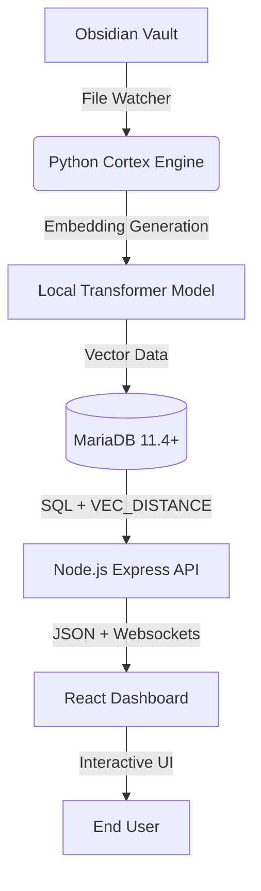

# 🧬 VectorSYNC: Neural Knowledge Bridge

> **The next evolution of Personal Knowledge Management.**
> *A high-performance semantic search layer for Obsidian, powered by MariaDB 11.4+ VEC Support.*

[](https://mariadb.com/)
[](https://reactjs.org/)
[](https://www.python.org/)
[](https://www.docker.com/)
[](https://www.typescriptlang.org/)
[](https://nodejs.org/)
[](https://tailwindcss.com/)
[](https://d3js.org/)
[](https://obsidian.md/)

---

## 🚀 The Vision

In an age of information overload, your "Second Brain" should do more than just store files—it should think with you. **VectorSYNC** bridges the gap between static Markdown files and dynamic conceptual retrieval. 

By leveraging **MariaDB's native Vector data type and distance functions**, VectorSYNC transforms your Obsidian vault into a low-latency, neural-indexed knowledge base that understands *what* you mean, not just *what* you typed.

## ✨ High-Fidelity Features

-   **🧠 Neural Semantic Discovery:** Find notes through conceptual similarity. No more "I forgot the exact keyword."
-   **🕸️ Conceptual Graph View:** A force-directed D3 visualization that draws real-time semantic links between your thoughts.
-   **⚡ Real-Time Sync:** A Python-based Cortex monitors your vault and re-indexes embeddings the moment you save a file.
-   **🛡️ Sovereign Privacy:** local-first architecture. Your embeddings are generated on your CPU and stored in your MariaDB instance.
-   **🎨 Cyber-Obsidian UI:** A high-contrast, polished dashboard designed for deep work and neural exploration.

---

## 🏗️ Technical Architecture



### The Stack
-   **Database:** MariaDB 11.4 (Utilizing `VECTOR` type, `VEC_DISTANCE`, and `VEC_FROMTEXT`).
-   **Cortex Engine:** Python 3.10+, `sentence-transformers`, `watchdog`.
-   **Neural API:** Node.js (V3.5+ Connector), `transformers.js` (fallback extraction).
-   **Interface:** React 18, Tailwind CSS, Framer Motion, D3.js.

---

## 📂 Project Organization

```text
├── api/                # Neural API & Express Backend
├── client/             # (src/) React Frontend source
├── engine/             # Python Cortex (Sync & Indexing)
│   └── cortex/         # Real-time watcher & processing logic
├── assets/             # Branding & UI optimized assets
├── docs/               # Technical implementation guides
└── ref/                # SQL Schemas & development references
```

---

## 🚀 Quick Start (6-Step Deployment)

For a detailed walkthrough, including Docker configuration and troubleshooting, see the [Full Implementation Guide](docs/GUIDE.md).

1. **Clone:** `git clone https://github.com/MariaDB-Hackathon-MY-2026/obsidian-mariadb-bridge.git`
2. **Path:** `cd VectorSYNC`
3. **Database:** `docker-compose up -d` (Requires Docker Desktop)
4. **Cortex:** `pip install -r requirements.txt && python engine/main.py`
5. **Interface:** `npm install && npm run dev`
6. **Access:** [http://localhost:3000](http://localhost:3000)

---

## 📜 Acknowledgments
-   **MariaDB Foundation** for the innovative Vector support.
-   **Hugging Face** for the state-of-the-art embedding models.
-   **Team Dopamine** - *Connecting the dots of human intuition with database performance.*

---
*VectorSYNC is a submission for the MariaDB Vector Hackathon 2026.*
